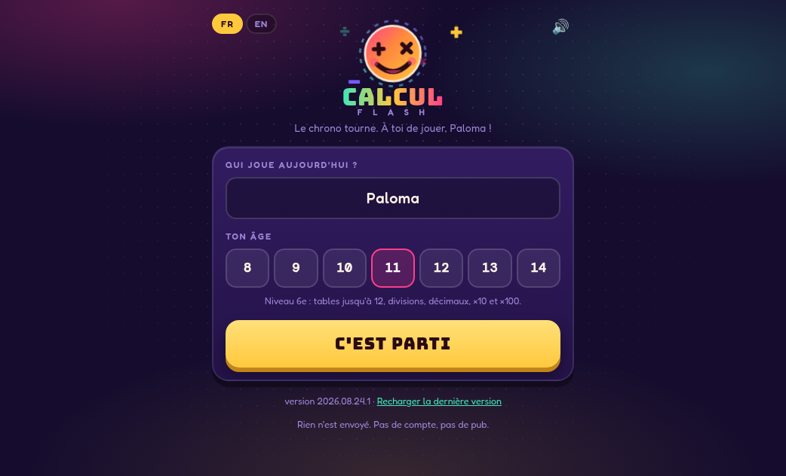
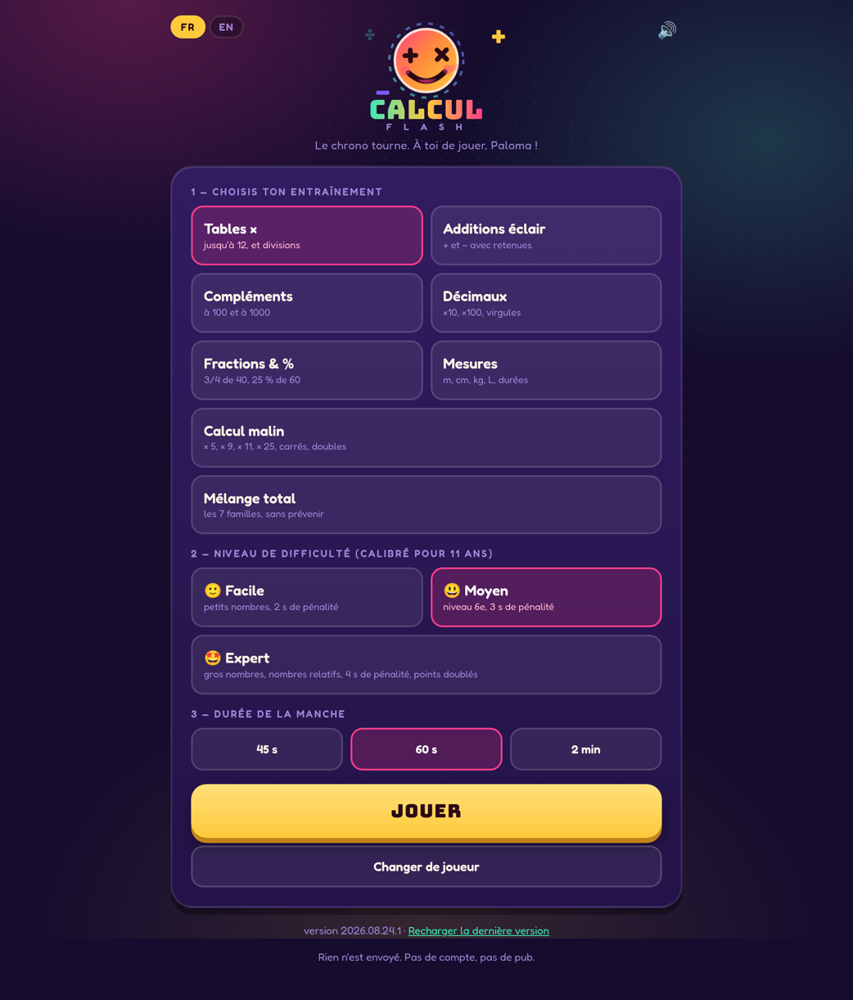
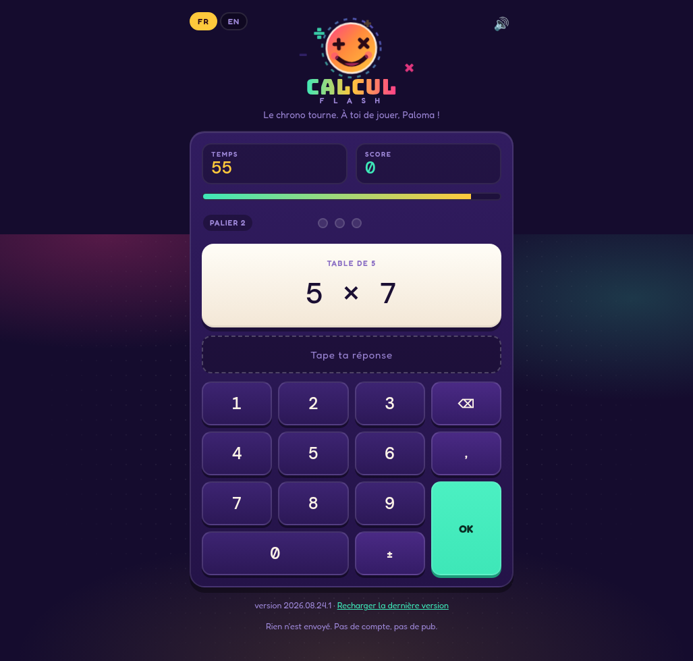

<div align="center">

# Calcul Flash

**60 secondes. Combien tu en as justes ?**
**60 seconds. How many can you get right?**

[](https://fschmutz.github.io/calcul-flash/)
[](LICENSE)
[](https://github.com/fschmutz/calcul-flash/wiki/Privacy)
[](https://github.com/fschmutz/calcul-flash/wiki)







**[Ouvrir le jeu / Open the live app →](https://fschmutz.github.io/calcul-flash/)**
· [wiki](https://github.com/fschmutz/calcul-flash/wiki)

</div>

Borne d'arcade. Prénom + âge 8–14, puis mode / difficulté / durée. Manche chronométrée, pavé numérique, multiplicateurs de série, un récap pour les parents, feux d'artifice canvas. Rien n'est envoyé.

Arcade cabinet. First name + age 8–14, then mode / difficulty / duration. Timed round, numeric pad, streak multipliers, a recap for parents, canvas fireworks. Nothing is uploaded.

Le français est la langue par défaut (et si `navigator.language` commence par `fr`). L'anglais est un bouton. Seuls la langue, le dernier joueur (prénom, âge) et les records locaux vont dans `localStorage`.

French is the default (and if `navigator.language` starts with `fr`). English is a toggle. Only language, last player (name, age), and local records go to `localStorage`.

## Why this one

Most kids' mental-math pages phone home, pull Google Fonts, and never let you retry the sums you actually missed. This one is a 60-second arcade cabinet that stays in the tab: age-calibrated generators, a numeric pad, streak multipliers, a recap for parents, and **Rejouer les erreurs / Retry the misses** that drills the exact items from the last round. Fonts are self-hosted woff2. CSP is `default-src 'self'`.

## Modes

| Mode | FR | EN |
| --- | --- | --- |
| `tables` | Tables × jusqu'à 12, et divisions | Times tables to 12, and division |
| `addsub` | + et − avec retenues | Lightning +/− with regrouping |
| `comp` | Compléments à 100 et à 1000 | Make 100 and 1000 |
| `deci` | ×10, ×100, virgules | ×10, ×100, decimals |
| `frac` | 3/4 de 40, 25 % de 60 | 3/4 of 40, 25% of 60 |
| `mes` | m, cm, kg, L, durées | m, cm, kg, L, time |
| `malin` | × 5, × 9, × 11, × 25, carrés, doubles | × 5, × 9, × 11, × 25, squares, doubles |
| `mix` | Les 7 familles, sans prévenir | All 7 families, no warning |

Age-calibrated 8–14. Easy / Medium / Expert. 45 s, 60 s, or 2 min. Web Audio beeps. Works offline after the first load.

## Privacy

No analytics, cookies, Sentry, Google, or CDN at runtime. Fonts are self-hosted woff2 (Bungee, Fredoka, DM Mono — OFL). CSP is `default-src 'self'` with `connect-src 'self'` (service worker). Details: [wiki/Privacy](https://github.com/fschmutz/calcul-flash/wiki/Privacy).

## Run it locally

```bash
python3 -m http.server 8080
# http://localhost:8080
```

```bash
node --test test/generate.test.mjs
```

If the live page looks stale after a new push, tap **Reload latest version** in the footer (or hard-refresh). The service worker otherwise keeps an old build.

## License

MIT. Copyright (c) 2026 [Falco Schmutz](https://github.com/fschmutz).
